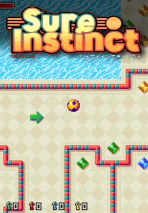
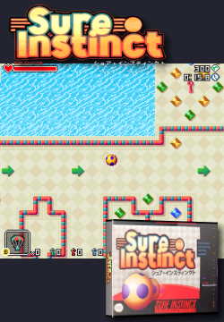
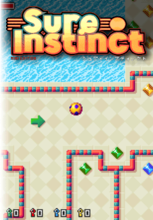
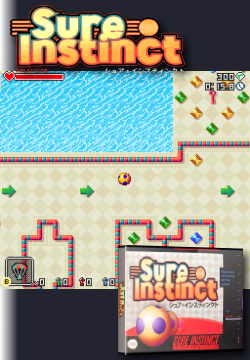
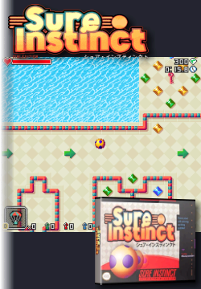

# onionscraper
A script to scrape artwork for OnionOS on the Miyoo Mini and Mini+. The actual scraping is done with Skyscraper.

### Requirements
- bash (Linux, MacOS, Cygwin...)
- Skyscraper: [Lars Muldjord](https://github.com/muldjord/skyscraper)'s original or [Detain](https://github.com/detain/skyscraper)'s more recent fork.
- xmlstarlet (optional): used to remove unnecessary data in the miyoogamelist.xml.

### Installation
Clone the repository or download the Zip file. Copy the content of `skyscraper` to `~/.skyscraper`. 

### Configuration
.skyscraper/config.ini
```
[main]
iinputFolder="PATH_TO_YOUR_ROMS"
artworkXml="artwork-onionscraper1.xml"
cacheMarquees="false"
cacheTextures="false"
relativePaths="true"
gameListBackup="false"
nameTemplate="%t"
frontend="emulationstation"

[screenscraper]
userCreds="USERNAME:PASSWORD"
```
*onionscraper* has a few options that can be configured by adding a config file as `.onionscraper` or `.config/onionscraper`. There is an example in the config directory.
```
# Scraping module for Skyscraper
#module=screenscraper

# Create a miyoogamelist.xml file for each system. Set to "false" to disable. 
#gamelist="true"

# System directory to exclude
#exclude=(PORTS PICO)

# Skyscraper config file (no quotes)
#skyscraperini=~/.skyscraper/config.ini
```

### Usage
```
Usage: onionscraper [OPTIONS] [SYSTEMS]
Scrape artwork for new ROMs or for given systems. Helps mananaging artwork.
options:
  -a --all:    check all platforms instead of just the ones with new ROMs.
  -c --clean:  remove images for deleted games.
  -p --pretend with clean, find but don't delete images.
  -v --vacuum  vacuum the Skyscraper cache (danger?).
  -i --import: import manually added assets.
  -s --skip:   skip existing output files.
  -d --device  use the Skyscraper config for the given device.
  -h --help:   this help.
systems:
  All parameters after the last option are treated as a list of systems
  to process. Ignored if the 'all' option is used.
```

Called without parameters, `onionscraper` will find new ROMS added since the previous run of the script
and scrape the artwork. A file called `miyoogamelist.xml` is generated or updated so device will show the game
titles instead of the file names. If `xmlstarlet` is installed, unnecessary information in this file 
will be removed.

The first invocation of `onionscraper` can take a while as all the ROMs are scraped.

You can provide your own images for the artwork. See below how to provide it. To use your newly added images, call the script with `-i` or `--import`.

If called with `-a` or `--all`, all the systems will be scanned instead of just the systems with new games.

### Artwork styles
The XML file used to generate the game artwork is defined in the Skyscraper configuration file. Two styles are included. You can use those as they are or modify them to fit your requirements.

    

**artwork-onionscraper1.xml**: The screenshot takes the entire height so the sides are cropped. The logo is added on top. 
- The width of the logo is fixed so tall logos take a lot of the available space.

**artwork-onionscraper2.xml**: The screenshot is shown in full in the middle. The logo is at the top and the front cover at the bottom right.
- This time the width of the logo is not fixed but the total area is. This doesn't work very well with logos that are not tall enough.
- An opaque layer is added as a background in the same colour as the default theme. For other themes, a different background image is needed. Or you can make it transparent by removing the background.

**artwork-onionscraper3.xml**: Same as style 1 but with the left edge becoming transparent. This can make the text of the game titles blend into the artwork.

**artwork-onionscraper4.xml**: Same as style 2 with the background becoming transparent on the left edge.

**artwork-onionscraper5.xml**: Same as style 2 with the left edge (background and screenshot) becoming transparent.

### Using multiple devices
If you use Skyscraper outside of onionscraper, you already have a config file and you don't want to overwrite it. Give your Skyscraper config of onionscraper a different name and set the correct file name in the onionscraper configuration.

```
# Skyscraper config file (no quotes)
skyscraperini=~/.skyscraper/config-onion.ini
```
If you have multiple devices that you want to use *onionscraper* with, you can have a configuration file for each use the `--device` option. The setup would be something like this:

.onionscraper.conf
```
# Skyscraper config file (no quotes)
skyscraperini=~/.skyscraper/config-mini.ini
```
Create a Skyscraper config file using the model above for each device. Let's say `.~/.skyscraper/config-mini.black.ini` and `.~/.skyscraper/config-mini.purple.ini`.

Call *onionscraper* with the name of the device you want.
```
onionscraper -d purple
```

### Using SSHFS with a Miyoo Mini Plus
Turn on SSH in the Apps section of OnionOS. Mount the Mini Plus filesystem locally, for example:
```
sshfs root@192.168.1.62:/mnt/SDCARD /mnt/mini
```
Adjust the inputFolder in the Skyscraper config to match.

Combined with the `--device` option, you can have a config to use SSH and a second when mounting the SD card.

### Importing local images
The artwork is generated from the *screenshot* and *wheel* assets.

See [Skyscraper's documentation](https://github.com/muldjord/skyscraper/blob/master/docs/IMPORT.md) on import for the details. By default, Skyscraper looks for images to import in `~/.skyscraper/import`.
Inside this directory, my preference is to store my images per platform and then per asset type. For example:
```
~/.skyscraper/import/snes/screenshot/Good Game (Europe).png
~/.skyscraper/import/wonderswan/screenshot/Another Game (Japan).png
```
Note that here the Skyscraper platforms are used, not the Miyoo system directories. So it is `snes` and not `SFC`, `wonderswan` and not `WS`, etc...
